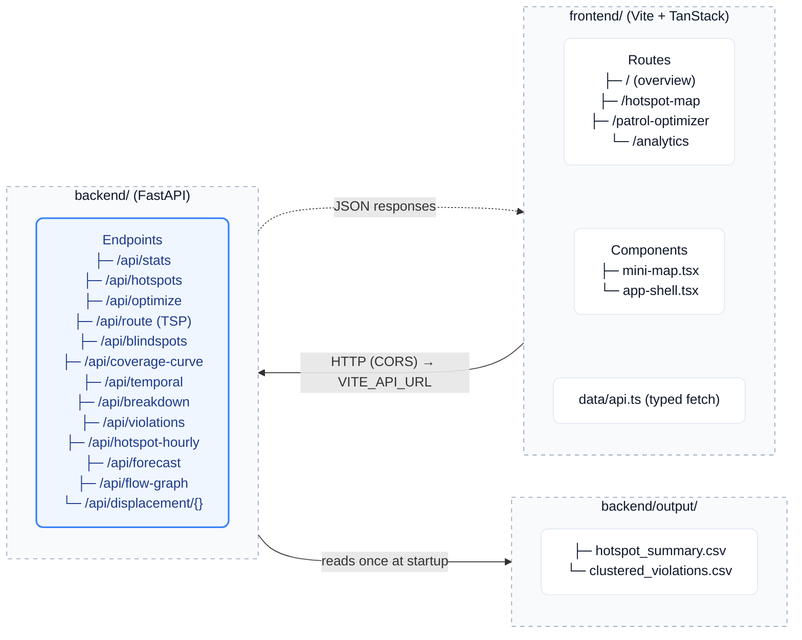

# ParkSight — Parking-Congestion Enforcement Intelligence

<p align="center">
  
  
  
  
  
  
  
</p>

> **AI-driven hotspot analysis and patrol-deployment optimizer for Bengaluru Traffic Police.**
> Built for Flipkart Gridlock 2.0 Round 2 (PS2 — Poor Visibility on Parking-Induced Congestion).

ParkSight turns 115,000+ anonymized parking violation records into an actionable enforcement command center: it finds where violations hurt most, deploys limited patrol units for maximum impact, surfaces the zones being missed today (enforcement blind spots), shows how congestion shifts hour-by-hour, models where demand displaces when a hotspot is cleared, and plots the optimal driving circuit for each shift.

---

## Table of Contents

- [Features](#features)
- [Architecture](#architecture)
- [Project Structure](#project-structure)
- [Quick Start](#quick-start)
  - [1 — Backend (FastAPI)](#1--backend-fastapi)
  - [2 — Frontend (Vite + TanStack)](#2--frontend-vite--tanstack)
- [API Reference](#api-reference)
- [Data Pipeline](#data-pipeline)
- [Analysis Scripts](#analysis-scripts)
- [Tech Stack](#tech-stack)

---

## Features

| # | Feature | Description |
|---|---------|-------------|
| 1 | **Interactive Hotspot Map** | 612 DBSCAN hotspots on a real Leaflet map, color-coded by congestion impact. Toggle-able layers: hotspot clusters, **hexbin congestion** (canvas hex-grid density), **blind spots**, and **raw violations** (sampled points). |
| 2 | **Time Machine (hour scrubber)** | A 0–23h slider + playback that animates how the hotspot heatmap shifts across the day, driven by real historical violation timing (time-of-day climatology). |
| 3 | **Spill-over / Displacement** | Click a hotspot → a learned graph random-walk traces where parking demand re-routes if it is enforced/cleared, so enforcement avoids whack-a-mole. |
| 4 | **Enforcement Blind Spots** | Zones with high congestion impact but low enforcement proxy — the areas being missed today. Ranked by a blind-spot score with Critical / High / Moderate severity. |
| 5 | **Patrol Optimizer + Coverage Curve** | Greedy max-coverage deployment (within 1−1/e of optimal): picks K patrol stations to cover the most road-capacity-weighted impact. Diminishing-returns curve with elbow → recommended fleet size, benchmarked vs even-spread and volume-only baselines. |
| 6 | **Patrol Route Optimizer** | TSP-optimal driving circuit (nearest-neighbour + 2-opt), road-snapped via OSRM. Returns total km, ETA, and ordered stop list. |
| 7 | **Temporal Heatmap & Breakdowns** | 7-day × 24-hour violation matrix + violation-type / vehicle-type distributions. |

---

## Architecture



The frontend calls the backend directly over CORS (no dev proxy); the base URL is `VITE_API_URL`, defaulting to `http://localhost:8000`.

**Data flow:**
1. Pre-computed data is available in `backend/output/hotspot_summary.csv` and `backend/output/clustered_violations.csv`.
2. *(Optional)* `backend/precompute.py` → enriches hotspots with OSM road geometry → `backend/data/hotspots_enriched.csv`
3. FastAPI reads the CSVs once at startup and serves JSON; the graph-diffusion model (`flow_model.py`) is built lazily on first request to the flow endpoints.

---

## Project Structure

```
ParkSight/
├── backend/                  # FastAPI API server
│   ├── main.py               # All endpoints
│   ├── core.py               # Coverage optimizer + TSP solver (pure numpy)
│   ├── data.py               # Data loading, blind-spots, stats (cached); lazy flow model
│   ├── flow_model.py         # Graph-diffusion forecaster: hourly profiles + displacement
│   ├── schemas.py            # Pydantic request/response models
│   ├── precompute.py         # One-time OSM road-grounding step
│   ├── requirements.txt
│   ├── README.md             # Backend-specific notes
│   └── output/               # Generated data + plots
│       ├── hotspot_summary.csv
│       ├── clustered_violations.csv
│       └── station_summary.csv
│
├── frontend/                 # Vite + TanStack Start/Router dashboard
│   ├── src/
│   │   ├── routes/           # File-based routes
│   │   │   ├── __root.tsx
│   │   │   ├── index.tsx           # City Overview
│   │   │   ├── hotspot-map.tsx     # Map + layers + Time Machine + displacement
│   │   │   ├── patrol-optimizer.tsx
│   │   │   └── analytics.tsx
│   │   ├── components/
│   │   │   ├── app-shell.tsx
│   │   │   └── mini-map.tsx        # Compact interactive Leaflet tile (homepage)
│   │   ├── data/
│   │   │   ├── api.ts              # Typed fetch helpers + transforms for all endpoints
│   │   │   └── mock.ts             # SSR fallbacks
│   │   ├── lib/utils.ts
│   │   └── styles.css
│   ├── vite.config.ts
│   └── package.json
```

---

## Quick Start

### Prerequisites

- Python 3.10+
- Node.js 20+ (npm; the project also has a `bun.lock` if you prefer bun)
- The generated `backend/output/` CSVs (already present)

### 1 — Backend (FastAPI)

```bash
cd backend
pip install -r requirements.txt

# (Optional) enrich hotspots with OSM road geometry — needs osmnx
#   python precompute.py

# Start the API server
python -m uvicorn main:app --reload --port 8000
```

Interactive API docs: **http://localhost:8000/docs**

### 2 — Frontend (Vite + TanStack)

```bash
cd frontend
npm install

# Optional: point at a non-default backend
#   echo "VITE_API_URL=http://localhost:8000" > .env

npm run dev
```

Open the Vite dev server (default **http://localhost:8080**). The app fetches the backend directly at `VITE_API_URL` (default `http://localhost:8000`), so the backend must be running.

---

## API Reference

| Method | Endpoint | Description |
|--------|----------|-------------|
| `GET` | `/health` | Liveness check |
| `GET` | `/api/stats` | Dashboard KPIs: hotspots, violations, recommended fleet, peak window |
| `GET` | `/api/hotspots` | All hotspots for the map/table — filterable by `violation`, `station`, `min_cii`, `limit` |
| `GET` | `/api/hotspots/{id}` | Single hotspot detail |
| `POST` | `/api/optimize` | Greedy max-coverage patrol plan · body: `{num_patrols, cover_radius_m}` |
| `GET` | `/api/coverage-curve` | Coverage % vs fleet size (optimized + 2 baselines) + elbow · params: `kmax`, `cover_radius_m` |
| `POST` | `/api/route` | TSP patrol circuit · body: `{num_patrols, cover_radius_m, avg_speed_kmh}` |
| `GET` | `/api/blindspots` | Enforcement blind spots ranked by blind-spot score · param: `top_n` |
| `GET` | `/api/temporal` | Day × hour violation heatmap (IST) + peak hours |
| `GET` | `/api/breakdown` | Violation-type and vehicle-type distributions |
| `GET` | `/api/violations` | Deterministic sample of individual violation points for the raw-violations layer · param: `limit` (100–8000) |
| `GET` | `/api/hotspot-hourly` | Per-hotspot 24-hour intensity profile (normalised 0–1) — powers the Time Machine slider |
| `GET` | `/api/forecast` | Graph-diffusion next-hour heatmap (now / predicted / actual per hotspot) · params: `hour` (0–23), `steps` (1–6) |
| `GET` | `/api/flow-graph` | Learned diffusion graph (strongest spill-over edges) + fitted params (alpha/beta/sigma) and diagnostics |
| `GET` | `/api/displacement/{id}` | Where displaced parking demand re-routes if the hotspot is cleared · params: `steps`, `top` |

### Key response shapes

<details>
<summary><code>POST /api/optimize</code></summary>

```json
{
  "num_patrols": 15,
  "cover_radius_m": 1000,
  "total_coverage_pct": 74.3,
  "baseline_even_pct": 51.2,
  "baseline_volume_pct": 60.1,
  "plan": [
    {
      "rank": 1, "lat": 12.97, "lon": 77.59,
      "station": "Upparpet", "road_class": "primary", "lanes": 4,
      "hotspots_covered": 28, "recommended_shift": "Morning (06:00-12:00)",
      "impact_covered_pct": 18.4
    }
  ]
}
```
</details>

<details>
<summary><code>GET /api/displacement/{id}</code></summary>

```json
{
  "source": { "id": 5, "lat": 13.00, "lon": 77.57, "name": "Malleshwaram" },
  "sigma_m": 1400,
  "steps": 4,
  "receivers": [
    { "id": 41, "lat": 13.02, "lon": 77.55, "name": "Yeshwanthpura", "share": 0.126 },
    { "id": 88, "lat": 12.99, "lon": 77.55, "name": "Rajajinagar",   "share": 0.124 }
  ]
}
```
</details>

<details>
<summary><code>GET /api/blindspots</code></summary>

```json
{
  "total_blind_spots": 30,
  "critical_count": 10,
  "high_count": 12,
  "moderate_count": 8,
  "zones": [
    {
      "id": 152, "rank": 153, "station": "Upparpet",
      "dominant_violation": "WRONG PARKING",
      "cii_normalized": 45.2, "impact_rank": 153, "enforcement_rank": 585,
      "blind_spot_score": 0.707, "severity": "Critical",
      "shift": "Morning (06:00-12:00)"
    }
  ]
}
```
</details>

---

## Data Pipeline

```
Pre-computed CSVs in backend/output/
    │
    ▼  backend/precompute.py  (optional — needs osmnx)
OSM road-grounding: snaps each hotspot to nearest OSM way
    → adds road_class, lanes, capacity_loss_factor, impact (capacity-weighted CII)
    │
    ▼  backend/data/hotspots_enriched.csv
    │
    ▼  backend/main.py  (runtime — sub-second per request)
FastAPI serves all endpoints from in-memory state
```

### Congestion Impact Index (CII)

Each hotspot's CII is computed as:

```
CII = Σ (violation_severity × vehicle_footprint × is_junction_bonus)
```

The **road-capacity-weighted impact** then scales CII by the inverse of lane count and road class weight — a blockage on a 2-lane road kills ~50% of throughput vs ~17% on a 6-lane arterial.

### Blind-Spot Score

```
impact_pct       = 1 − (impact_rank − 1) / (N − 1)       # 1 = most impactful
enforcement_pct  = 1 − (enforcement_rank − 1) / (N − 1)  # 1 = most enforced
blind_spot_score = max(0, impact_pct − enforcement_pct)
```

Enforcement is proxied by `(zone_violations / station_mean_violations) × 50 + (cii_density / max_density) × 50`.

### Graph-Diffusion Flow Model (`flow_model.py`)

A kNN graph is built over the 612 hotspots with **learned** distance-decay weights `W_ij = exp(−d_ij / σ)`, where σ (the spatial spill-over range) and the diffusion coefficients are fit by least squares to the real hour-to-hour dynamics:

```
x(h+1) = α·x(h) + β·(W − I)·x(h)        # graph-Laplacian diffusion
```

Two honest products are surfaced from it: the **Time Machine** slider (time-of-day climatology — a legitimate short-horizon forecast) and **displacement** (a random walk over the learned graph showing where demand re-routes when a hotspot is enforced). Note: as a pure next-hour *forecaster*, this diffusion barely beats a persistence baseline at hour-of-day resolution — so we present it as climatology + spill-over, not as a skill-claiming predictor.

---


## Tech Stack

**Backend**
- [FastAPI](https://fastapi.tiangolo.com/) — REST API
- [scikit-learn](https://scikit-learn.org/) `BallTree` — sub-second spatial coverage index + kNN flow graph
- [httpx](https://www.python-httpx.org/) — OSRM road-snapping requests
- [pandas](https://pandas.pydata.org/) / [numpy](https://numpy.org/) — data + diffusion model
- [osmnx](https://osmnx.readthedocs.io/) *(optional, offline only)* — OSM road graph for precompute

**Frontend**
- [Vite](https://vite.dev/) + [TanStack Start / Router](https://tanstack.com/) (SSR, file-based routes) + TypeScript
- [react-leaflet](https://react-leaflet.js.org/) + Leaflet (canvas) — interactive maps, hexbin, flow overlays
- [shadcn/ui](https://ui.shadcn.com/) (Radix) + [Tailwind CSS](https://tailwindcss.com/) — component system
- [Recharts](https://recharts.org/) — coverage curve + breakdown charts
- [lucide-react](https://lucide.dev/) — icons

---

## License

MIT
