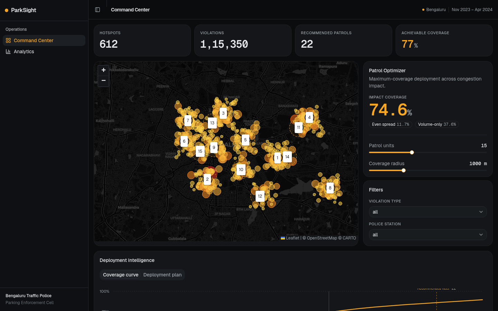
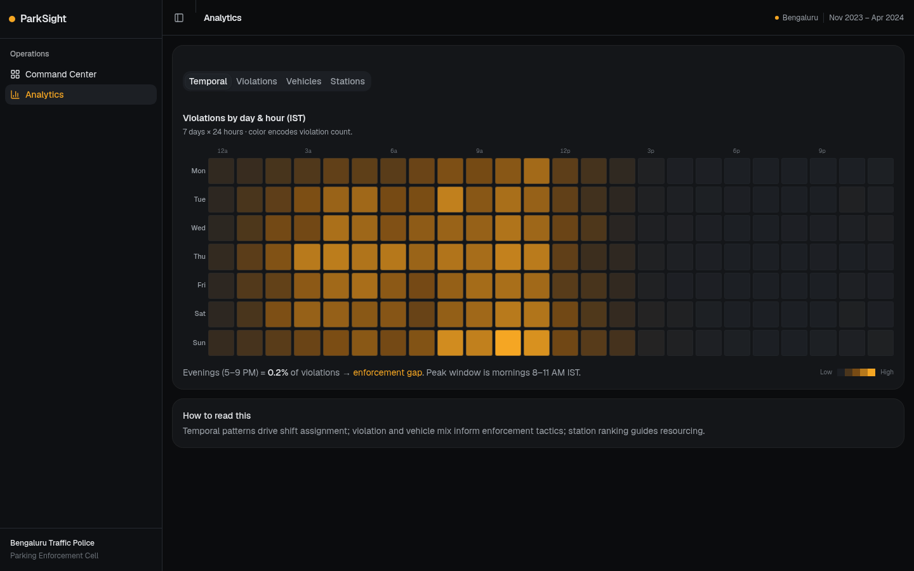
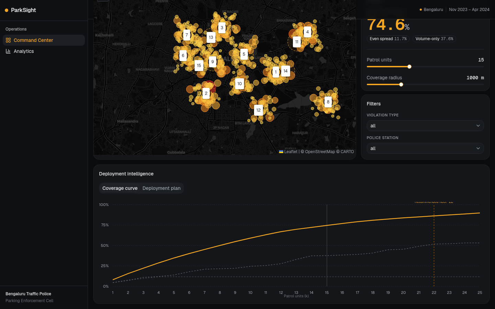

# ParkSight — Parking-Congestion Enforcement Intelligence

> **AI-driven hotspot analysis and patrol-deployment optimizer for Bengaluru Traffic Police.**
> Built for Flipkart Gridlock 2.0 Round 2.

ParkSight turns 115,000+ anonymized parking violation records into an actionable enforcement command center: it finds where violations hurt most, deploys limited patrol units for maximum impact, surfaces the zones being missed today (enforcement blind spots), and plots the optimal driving circuit for each shift.

---

## Table of Contents

- [Demo Screenshots](#demo-screenshots)
- [Features](#features)
- [Architecture](#architecture)
- [Project Structure](#project-structure)
- [Quick Start](#quick-start)
  - [1 — Backend (FastAPI)](#1--backend-fastapi)
  - [2 — Frontend (Next.js)](#2--frontend-nextjs)
- [API Reference](#api-reference)
- [Data Pipeline](#data-pipeline)
- [Analysis Scripts](#analysis-scripts)
- [Tech Stack](#tech-stack)

---

## Demo Screenshots

| Command Center | Analytics — Blind Spots | Analytics — Patrol Route |
|:---:|:---:|:---:|
|  |  |  |

---

## Features

| # | Feature | Description |
|---|---------|-------------|
| 1 | **Patrol Route Optimizer** | TSP-optimal driving circuit through patrol stations — road-snapped via OSRM with nearest-neighbour + 2-opt improvement. Returns total km, ETA, and ordered stop list. |
| 2 | **Enforcement Blind Spots** | Surfaces zones with high congestion impact but low enforcement proxy — the areas being missed today. Ranked by a blind-spot score with Critical / High / Moderate severity. |
| 3 | **Congestion Impact Optimizer** | Greedy max-coverage deployment: picks K patrol stations to cover the most road-capacity-weighted impact (within 1−1/e of optimal). Benchmarked against even-spread and volume-only baselines. |
| 4 | **Coverage vs Fleet Curve** | Diminishing-returns chart across fleet sizes with automatic elbow detection → recommended fleet size. |
| 5 | **Temporal Heatmap** | 7-day × 24-hour violation matrix revealing shift-level enforcement gaps (evening under-coverage). |
| 6 | **Violation & Vehicle Breakdown** | Bar charts by violation type, vehicle type, and police station jurisdiction. |
| 7 | **Interactive Hotspot Map** | 612 hotspots color-coded by congestion impact; patrol coverage radii overlaid; route circuit animated. |

---

## Architecture

```
┌─────────────────────────┐        HTTP / Next.js proxy
│   frontend/  (Next.js)  │  ──────────────────────────►  ┌──────────────────────────┐
│                         │                                │  backend/  (FastAPI)     │
│  Pages                  │  ◄────────────────────────────  │                          │
│  ├─ /command            │        JSON responses          │  Endpoints               │
│  └─ /analytics          │                                │  ├─ /api/stats           │
│                         │                                │  ├─ /api/hotspots        │
│  Components             │                                │  ├─ /api/optimize        │
│  ├─ HotspotMap          │                                │  ├─ /api/route  (TSP)    │
│  ├─ PatrolOptimizer     │                                │  ├─ /api/blindspots      │
│  ├─ BlindSpotsPanel     │                                │  ├─ /api/coverage-curve  │
│  ├─ RouteOptimizerPanel │                                │  ├─ /api/temporal        │
│  └─ CoverageCurveChart  │                                │  └─ /api/breakdown       │
└─────────────────────────┘                                └──────────────────────────┘
                                                                        │
                                                           reads once at startup
                                                                        │
                                                           ┌────────────▼─────────────┐
                                                           │  output/                 │
                                                           │  ├─ hotspot_summary.csv  │
                                                           │  └─ clustered_violations │
                                                           │       .csv               │
                                                           └──────────────────────────┘
```

**Data flow:**
1. Raw CSV → `analysis/parking_hotspot_analysis.py` → `output/hotspot_summary.csv` + `output/clustered_violations.csv`
2. *(Optional)* `backend/precompute.py` → enriches hotspots with OSM road geometry → `backend/data/hotspots_enriched.csv`
3. FastAPI reads the CSVs once at startup, serves JSON to the Next.js frontend

---

## Project Structure

```
ParkSight/
├── backend/                  # FastAPI API server
│   ├── main.py               # All endpoints
│   ├── core.py               # Coverage optimizer + TSP solver (pure numpy)
│   ├── data.py               # Data loading, blind-spots, stats (cached)
│   ├── schemas.py            # Pydantic request/response models
│   ├── precompute.py         # One-time OSM road-grounding step
│   ├── requirements.txt
│   ├── README.md             # Backend-specific notes
│   └── data/
│       └── hotspots_enriched.csv   # (gitignored — generated by precompute.py)
│
├── frontend/                 # Next.js 15 dashboard
│   ├── app/
│   │   └── (dashboard)/
│   │       ├── command/      # Command Center page
│   │       └── analytics/    # Analytics page (Temporal, Blind Spots, Patrol Route, …)
│   ├── components/
│   │   ├── hotspot-map.tsx
│   │   ├── blind-spots-panel.tsx
│   │   ├── route-optimizer-panel.tsx
│   │   ├── patrol-route-map.tsx
│   │   ├── patrol-route-layer.tsx
│   │   ├── patrol-optimizer.tsx
│   │   ├── coverage-curve-chart.tsx
│   │   ├── deployment-plan-table.tsx
│   │   ├── temporal-heatmap.tsx
│   │   └── breakdown-bar-chart.tsx
│   ├── lib/
│   │   ├── api.ts            # Typed fetch helpers for all endpoints
│   │   ├── types.ts          # TypeScript interfaces
│   │   ├── stations.ts       # Station name list
│   │   └── format.ts         # heatColor, formatIN utilities
│   ├── .env.local.example    # Copy to .env.local for local dev
│   └── next.config.mjs       # Proxies /api/* → localhost:8000
│
├── analysis/                 # Offline data-science scripts (run once)
│   ├── parking_hotspot_analysis.py   # DBSCAN clustering + hotspot scoring
│   ├── validate_clustering.py        # Cluster validation + seasonal R² test
│   └── enforcement_optimizer.py      # OSM road-grounding (used by precompute.py)
│
├── output/                   # Generated data + plots (gitignored)
│   ├── hotspot_summary.csv
│   ├── clustered_violations.csv
│   └── *.png
│
└── jan to may police violation_anonymized791b166.csv   # Raw data (gitignored)
```

---

## Quick Start

### Prerequisites

- Python 3.10+
- Node.js 20+ and [pnpm](https://pnpm.io/)
- The raw violation CSV (placed in the repo root)

### 1 — Backend (FastAPI)

```bash
# Install dependencies
cd backend
pip install -r requirements.txt

# (Only if output/ doesn't exist yet) Run the analysis pipeline
cd ..
python analysis/parking_hotspot_analysis.py

# (Optional) Enrich hotspots with OSM road geometry
# Requires osmnx — skip if hotspot_summary.csv already exists
python backend/precompute.py

# Start the API server
cd backend
uvicorn main:app --reload --port 8000
```

Interactive API docs: **http://localhost:8000/docs**

### 2 — Frontend (Next.js)

```bash
cd frontend

# Copy environment config
cp .env.local.example .env.local   # points to localhost:8000

# Install dependencies
pnpm install

# Start dev server
pnpm dev
```

Open **http://localhost:3000** — the Next.js proxy forwards all `/api/*` calls to the FastAPI backend automatically.

---

## API Reference

| Method | Endpoint | Description |
|--------|----------|-------------|
| `GET` | `/health` | Liveness check |
| `GET` | `/api/stats` | Dashboard KPIs: total hotspots, violations, recommended fleet, peak window |
| `GET` | `/api/hotspots` | All hotspots for the map/table — filterable by `violation`, `station`, `min_cii`, `limit` |
| `GET` | `/api/hotspots/{id}` | Single hotspot detail |
| `POST` | `/api/optimize` | Greedy max-coverage patrol plan · body: `{num_patrols, cover_radius_m}` |
| `GET` | `/api/coverage-curve` | Coverage % vs fleet size (optimized + 2 baselines) + elbow · params: `kmax`, `cover_radius_m` |
| `POST` | `/api/route` | TSP patrol circuit · body: `{num_patrols, cover_radius_m, avg_speed_kmh}` |
| `GET` | `/api/blindspots` | Enforcement blind spots ranked by blind-spot score · param: `top_n` |
| `GET` | `/api/temporal` | Day × hour violation heatmap (IST) + peak hours |
| `GET` | `/api/breakdown` | Violation-type and vehicle-type distributions |

### Key response shapes

<details>
<summary><code>POST /api/optimize</code></summary>

```json
{
  "num_patrols": 15,
  "cover_radius_m": 1000,
  "total_coverage_pct": 74.3,
  "baseline_even_pct": 51.2,
  "baseline_volume_pct": 60.1,
  "plan": [
    {
      "rank": 1, "lat": 12.97, "lon": 77.59,
      "station": "Upparpet", "road_class": "primary", "lanes": 4,
      "hotspots_covered": 28, "recommended_shift": "Morning (06:00-12:00)",
      "impact_covered_pct": 18.4
    }
  ]
}
```
</details>

<details>
<summary><code>POST /api/route</code></summary>

```json
{
  "stops": [
    {
      "order": 1, "lat": 12.97, "lon": 77.59, "station": "Upparpet",
      "hotspots_covered": 28, "recommended_shift": "Morning (06:00-12:00)",
      "dist_to_next_km": 2.3, "time_to_next_min": 5.5
    }
  ],
  "total_distance_km": 21.4,
  "total_time_min": 51.0,
  "polyline": [[12.97, 77.59], ...],
  "route_source": "osrm"
}
```
</details>

<details>
<summary><code>GET /api/blindspots</code></summary>

```json
{
  "total_blind_spots": 30,
  "critical_count": 10,
  "high_count": 12,
  "moderate_count": 8,
  "zones": [
    {
      "id": 152, "rank": 153, "station": "Upparpet",
      "dominant_violation": "WRONG PARKING",
      "cii_normalized": 45.2, "impact_rank": 153, "enforcement_rank": 585,
      "blind_spot_score": 0.707, "severity": "Critical",
      "shift": "Morning (06:00-12:00)"
    }
  ]
}
```
</details>

---

## Data Pipeline

```
Raw CSV (115k violations, Jan–May 2024)
    │
    ▼  analysis/parking_hotspot_analysis.py
DBSCAN clustering (eps=50m, min_samples=10)
    → 612 hotspots with CII, peak hour, dominant violation/vehicle/junction
    │
    ▼  output/hotspot_summary.csv  +  output/clustered_violations.csv
    │
    ▼  backend/precompute.py  (optional — needs osmnx)
OSM road-grounding: snaps each hotspot to nearest OSM way
    → adds road_class, lanes, capacity_loss_factor, impact (capacity-weighted CII)
    │
    ▼  backend/data/hotspots_enriched.csv
    │
    ▼  backend/main.py  (runtime — sub-second per request)
FastAPI serves all endpoints from in-memory state
```

### Congestion Impact Index (CII)

Each hotspot's CII is computed as:

```
CII = Σ (violation_severity × vehicle_footprint × is_junction_bonus)
```

The **road-capacity-weighted impact** then scales CII by the inverse of lane count and road class weight — a blockage on a 2-lane road kills ~50% of throughput vs ~17% on a 6-lane arterial.

### Blind-Spot Score

```
impact_pct       = 1 − (impact_rank − 1) / (N − 1)       # 1 = most impactful
enforcement_pct  = 1 − (enforcement_rank − 1) / (N − 1)  # 1 = most enforced
blind_spot_score = max(0, impact_pct − enforcement_pct)
```

Enforcement is proxied by `(zone_violations / station_mean_violations) × 50 + (cii_density / max_density) × 50`.

---

## Analysis Scripts

| Script | Purpose | Run from repo root |
|--------|---------|-------------------|
| `analysis/parking_hotspot_analysis.py` | Full clustering + hotspot scoring pipeline | `python analysis/parking_hotspot_analysis.py` |
| `analysis/validate_clustering.py` | Cluster quality metrics + seasonal R² validation | `python analysis/validate_clustering.py` |
| `analysis/enforcement_optimizer.py` | OSM road-grounding + standalone optimizer (also imported by precompute.py) | `python analysis/enforcement_optimizer.py` |

All scripts read from the repo-root CSV and write outputs to `output/`.

---

## Tech Stack

**Backend**
- [FastAPI](https://fastapi.tiangolo.com/) — async REST API
- [scikit-learn](https://scikit-learn.org/) `BallTree` — sub-second spatial coverage index
- [httpx](https://www.python-httpx.org/) — async OSRM road-snapping requests
- [pandas](https://pandas.pydata.org/) / [numpy](https://numpy.org/) — data layer
- [osmnx](https://osmnx.readthedocs.io/) *(optional, offline only)* — OSM road graph for precompute

**Frontend**
- [Next.js 15](https://nextjs.org/) (App Router) + TypeScript
- [react-leaflet](https://react-leaflet.js.org/) — interactive maps
- [shadcn/ui](https://ui.shadcn.com/) + [Tailwind CSS](https://tailwindcss.com/) — component system
- [SWR](https://swr.vercel.app/) — data fetching + caching
- [Recharts](https://recharts.org/) — coverage curve + breakdown charts

---

## License

MIT
