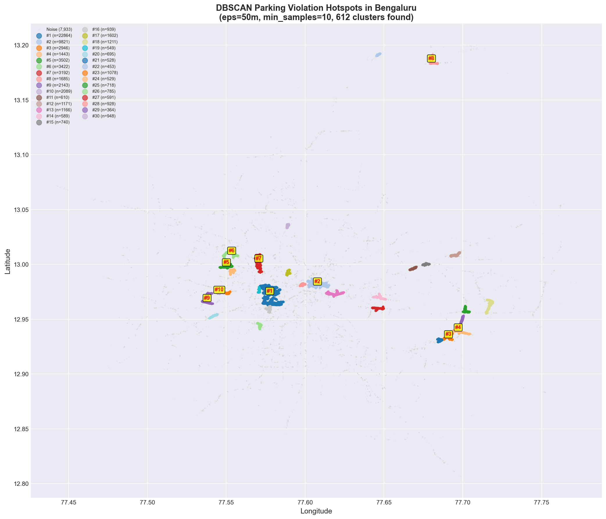
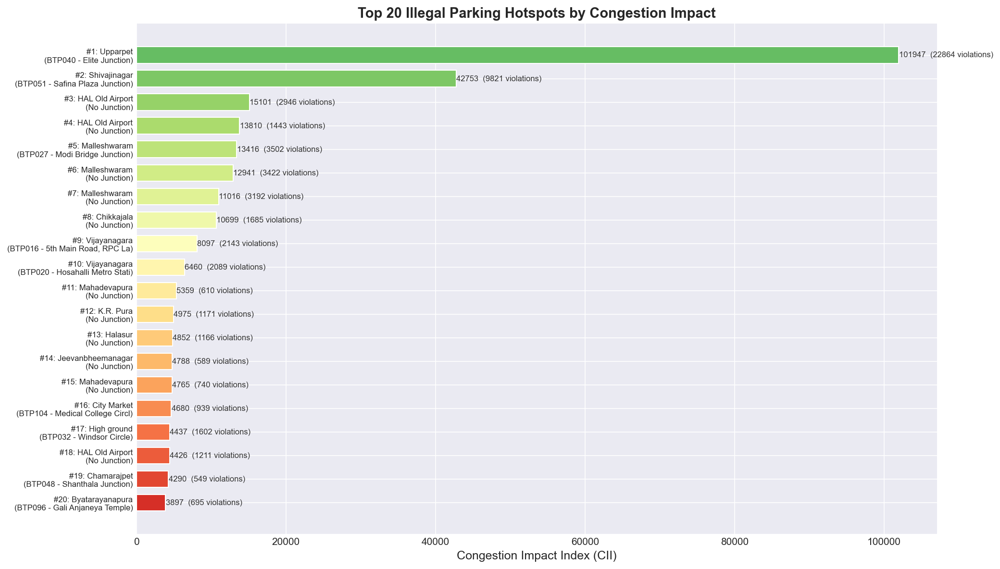
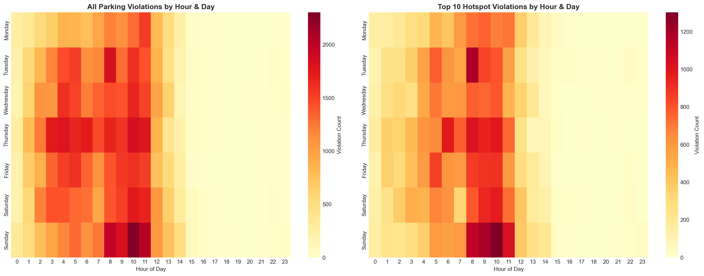
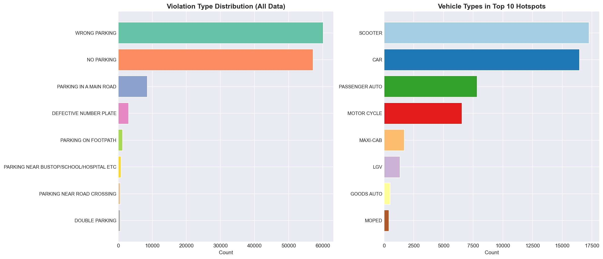
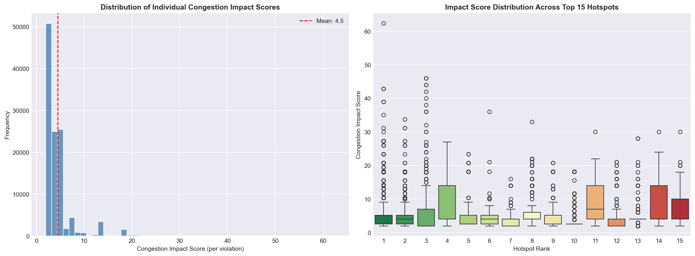
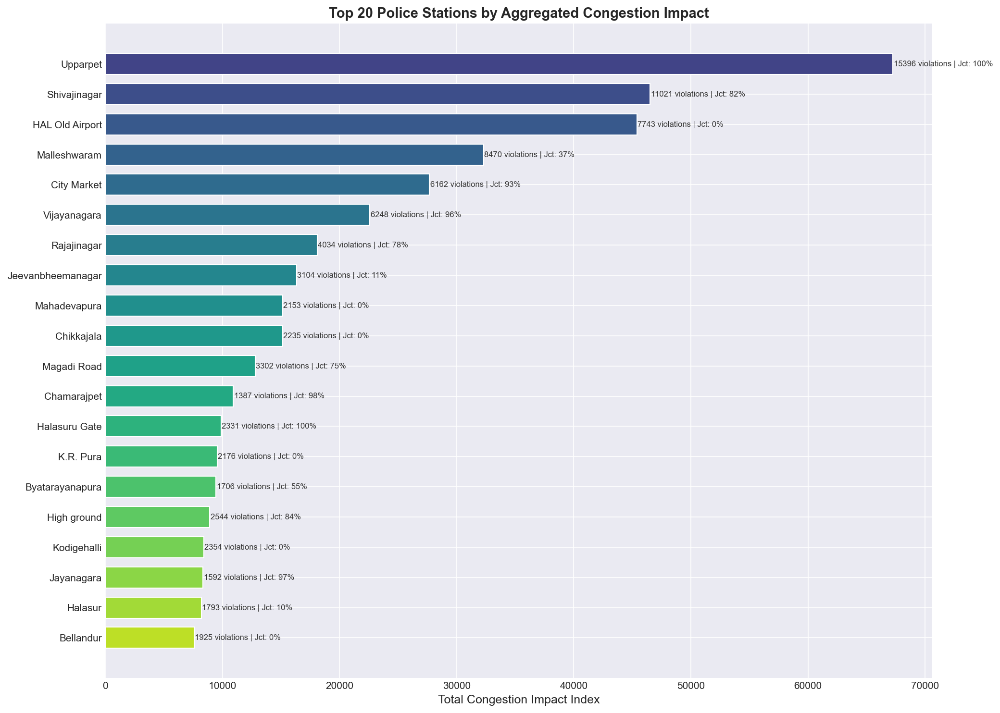

# DBSCAN Parking Violation Hotspot Analysis - Results Walkthrough

## Overview

Successfully analyzed **298,450 parking violation records** from Bengaluru police (Nov 2023 - Apr 2024) using DBSCAN spatial clustering to identify illegal parking hotspots and quantify their congestion impact.

| Metric | Value |
|--------|-------|
| Raw records | 298,450 |
| Approved & cleaned records | 115,350 (38.7%) |
| DBSCAN parameters | eps=50m, min_samples=10 |
| **Clusters (hotspots) found** | **612** |
| Clustered violations | 107,417 (93.1%) |
| Noise points | 7,933 (6.9%) |

---

## Key Findings

### 1. Spatial Hotspot Map

DBSCAN identified **612 distinct parking violation hotspots** across Bengaluru. The spatial distribution clearly shows concentration in the central business district (Upparpet, Shivajinagar, Malleshwaram) with secondary clusters in suburban commercial areas (HAL Old Airport, Vijayanagara).



> [!IMPORTANT]
> **93.1% of violations** fall into identifiable hotspot clusters, meaning parking violations are highly concentrated and NOT random - this validates the DBSCAN approach.

---

### 2. Top 20 Hotspots Ranked by Congestion Impact Index (CII)

The CII formula weights each violation by: `Severity × Vehicle Footprint × (1 + 0.3 × Junction Flag)`

Peak hours below are in **IST** (Asia/Kolkata).

| Rank | Area | Junction | CII | Violations | Junction% | Peak Hour (IST) |
|------|------|----------|-----|------------|-----------|-----------|
| #1 | **Upparpet** | Elite Junction | 101,947 | 22,864 | 97.8% | 09:00 |
| #2 | **Shivajinagar** | Safina Plaza Junction | 42,753 | 9,821 | 81.9% | 10:00 |
| #3 | **HAL Old Airport** | No Junction | 15,101 | 2,946 | 0% | 04:00 |
| #4 | **HAL Old Airport** | No Junction | 13,810 | 1,443 | 0% | 06:00 |
| #5 | **Malleshwaram** | Modi Bridge Junction | 13,416 | 3,502 | 100% | 08:00 |



> [!WARNING]
> **Upparpet (Elite Junction)** dominates with CII = 101,947 - nearly **2.4x the second-ranked hotspot**. With 22,864 violations and 97.8% junction proximity, this is the single highest-priority enforcement zone for congestion relief.

---

### 3. Temporal Patterns

````carousel
#### All Violations - Temporal Heatmap

<!-- slide -->
#### Key Temporal Insights (IST)

All timestamps converted from UTC to **IST (Asia/Kolkata)** before analysis.

| Pattern | Detail |
|---------|--------|
| **Peak window** | **08:00–12:00 (44% of all violations)** — morning commercial rush |
| **Secondary window** | 00:00–06:00 (42%) — overnight/early-morning street parking |
| **Evening (17:00–21:00)** | **Only 0.2%** of records — effectively unmonitored |
| **Peak days** | Thursday and Sunday highest; Monday lowest |

> [!NOTE]
> Recorded violations concentrate in the **morning (8 AM–12 PM)** and **overnight (12–6 AM)** windows. The near-total absence of evening records (5–9 PM = 0.2%) is itself an **enforcement/coverage gap** — evening illegal parking is essentially not being captured, a clear target for added monitoring.
````

---

### 4. Violation & Vehicle Type Breakdown



- **WRONG PARKING** (60,150) and **NO PARKING** (57,186) dominate, accounting for ~90% of all violations
- **PARKING IN A MAIN ROAD** (8,571) is the most congestion-impactful type despite lower frequency
- In top hotspots, **Scooters and Cars** are the most frequent violators, but **Passenger Autos** are disproportionately represented

---

### 5. Congestion Impact Score Distribution



- Mean per-violation impact score: **4.5** (right-skewed distribution)
- The **HAL Old Airport** hotspots have **higher median impact scores** despite fewer violations, driven by heavier vehicles and main-road parking
- The long right tail represents multi-violation records with large vehicles on main roads

---

### 6. Police Station-Level Enforcement Priority



> [!TIP]
> **Top 5 stations for enforcement priority**: Upparpet, Shivajinagar, HAL Old Airport, Malleshwaram, Vijayanagara - these account for the majority of congestion impact.

---

### 7. Enforcement Command Center — Patrol Deployment Optimizer

This turns the hotspot analysis into an **actionable patrol plan**: given a limited number of
patrol units, where should they be stationed (and in which shift) to relieve the most
parking-induced congestion?

**How it works** (`enforcement_optimizer.py`):
1. **Road-grounded impact** — each hotspot is snapped to its actual road segment via OpenStreetMap,
   pulling **lane count + road class**. A blockage on a 2-lane road kills ~50% of capacity; on a
   6-lane arterial ~17%. So impact is weighted by `(1 / lanes) × road-class-weight` — a physical
   capacity-loss measure, not just a point score.
2. **Maximum-coverage optimization** — a patrol stationed at a location covers every hotspot within
   **1 km**. A greedy submodular algorithm (provably near-optimal) picks the K locations covering the
   most total impact. Because coverage zones overlap, this genuinely *optimizes* placement rather than
   naively picking the top-K hotspots.
3. **Baseline comparison + fleet sizing** — we compare against "spread evenly" and "chase raw volume",
   and chart diminishing returns to recommend the optimal fleet size (the elbow).


**Results — % of total parking-congestion impact covered:**

| Patrol units | **Optimized** | Spread evenly | Chase raw volume |
|---|---|---|---|
| 5  | **47.9%** | 8.1%  | 37.5% |
| 10 | **59.4%** | 12.7% | 52.8% |
| 15 | **67.7%** | 19.5% | 57.5% |
| 22 (recommended) | **77.0%** | — | — |

> [!IMPORTANT]
> **5 optimally-placed patrols cover ~48% of the city's parking-congestion impact** — vs only **8%**
> if spread evenly. The diminishing-returns curve recommends a fleet of **~22 units (77% coverage)**;
> beyond that each extra unit adds <1%. This is the difference between reactive patrolling and
> data-optimized deployment.

The full plan (`optimized_deployment.csv`) lists each patrol's location, road class/lanes, hotspots
covered, **recommended shift**, and % impact covered — a ready-to-hand deployment sheet.

---

## Files Produced

| File | Description |
|------|-------------|
| [parking_hotspot_analysis.py](../parking_hotspot_analysis.py) | Main analysis script (DBSCAN + CII) |
| [validate_clustering.py](../validate_clustering.py) | DBSCAN cluster-quality validation (silhouette, eps-sensitivity) |
| [enforcement_optimizer.py](../enforcement_optimizer.py) | Patrol deployment optimizer (road-grounded + max-coverage) |
| [hotspot_summary.csv](./hotspot_summary.csv) | 612 hotspots ranked by CII (+ cii_density) |
| [clustered_violations.csv](./clustered_violations.csv) | 115K records with cluster labels & impact scores |
| [station_summary.csv](./station_summary.csv) | Police station-level aggregation |
| [optimized_deployment.csv](./optimized_deployment.csv) | Recommended patrol plan: location, shift, coverage |

---

## Methodology

### DBSCAN Configuration
- **Metric**: Haversine (great-circle distance on lat/lon in radians)
- **eps**: 50 meters (converted to 0.000008 radians) - typical road segment influence zone
- **min_samples**: 10 - minimum violations to form a viable hotspot
- **Algorithm**: BallTree for efficient spatial indexing

### Congestion Impact Score Formula
$$CIS = \text{Violation Severity} \times \text{Vehicle Footprint} \times (1 + 0.3 \times \text{Junction Flag})$$

Where:
- **Violation Severity**: MAIN ROAD(5), DOUBLE PARKING(3), BUS STOP(3), ROAD CROSSING(3), FOOTPATH/WRONG/NO PARKING(2)
- **Vehicle Footprint**: TANKER/BUS/TRUCK/LGV(3), CAR/MAXI-CAB/AUTO(2), SCOOTER/BIKE(1)
- **Junction Flag**: +30% multiplier if at a named junction

> [!NOTE]
> The CIS is a **transparent, domain-weighted prioritization index**: it scores each violation by how much it physically obstructs the carriageway (obstruction severity × vehicle road-space × junction proximity). It is an *enforcement-priority proxy* for likely congestion impact, computed from the parking data — not a measured traffic-flow figure. The weights are explainable and adjustable, which is what makes the ranking auditable for enforcement planning.

### Congestion Impact Index (CII) per Hotspot
$$CII = \sum_{i \in \text{cluster}} CIS_i$$

### Enforcement Optimizer
- **Road grounding**: hotspot → nearest OSM drive-network edge → `lanes`, `highway` class.
  `capacity_loss_factor = (1 / lanes) × class_weight`; `impact = CII × capacity_loss_factor`.
- **Coverage**: a patrol covers all hotspots within **1 km** (BallTree, haversine).
- **Optimization**: greedy maximum-coverage (submodular, ~63% of optimum guaranteed) over candidate
  stations; recommended fleet size = elbow where marginal coverage gain drops below 1%.
- **Shift** per station from the hotspot's IST peak hour (Morning/Afternoon/Evening/Night).

---

## Recent Updates (what changed in this revision)
- **Timezone fix (IST)** — all hour/day analysis now converts UTC→Asia/Kolkata. Peak hours moved
  from a misleading "2–5 AM" to the real **morning commercial rush (8–10 AM)**; evenings (5–9 PM)
  shown as a coverage gap. *(Affects temporal heatmap + §3.)*
- **Refined impact weights** — severity/footprint/junction updated (Main Road→5, Double Parking 5→3,
  Passenger Auto→2, Junction multiplier 2×→1.3×). Slightly re-ranks hotspots (HAL Old Airport rises;
  Upparpet CII 128,933→101,947).
- **Added `cii_density`** intensity metric so severe-but-smaller hotspots surface, not just busiest.
- **NEW: `enforcement_optimizer.py`** — the Patrol Deployment Optimizer (§7) + `coverage_curve.png`
  + `optimized_deployment.csv`.
- **Fixes**: matplotlib `get_cmap` deprecation; longitude-scaled hotspot radius; robust dataset path.
